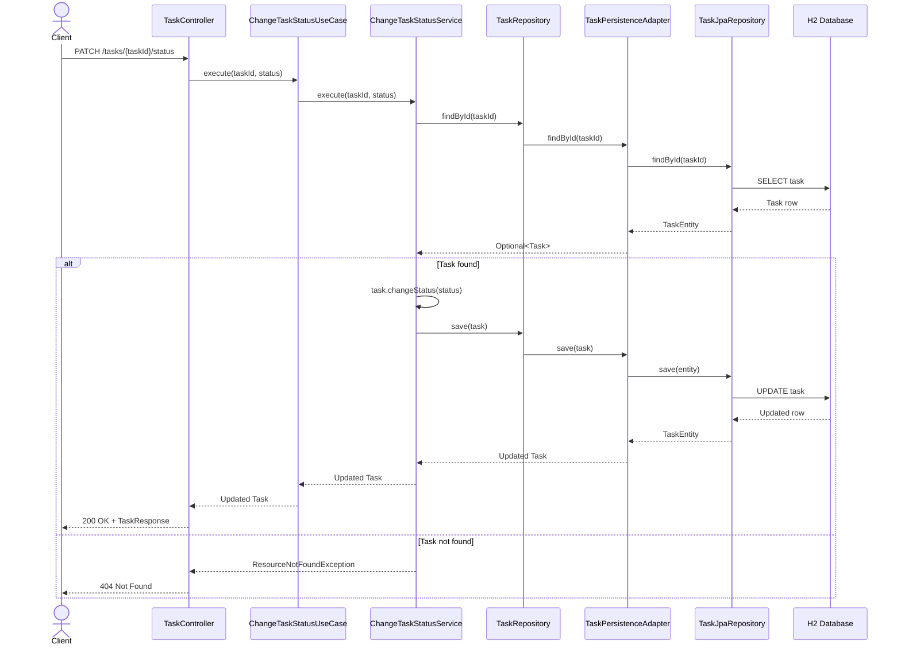

# Task Management Aplication

A RESTful API for a simplified task management system inspired by tools such as Trello and Jira.

This project was developed as a study project to practice **Clean Architecture**, separation of concerns, domain modeling, use cases, DTOs, mappers, and persistence with Spring Data JPA.

---

## Overview

The application allows users to manage projects and their tasks.

The main features are:

- Create projects;
- Register users;
- Create tasks within projects;
- Assign users to tasks;
- Change task status;
- List tasks from a project.

In this version, task board columns are represented by task statuses. A separate `Column` entity is not used.

Available statuses:

- `TODO`
- `IN_PROGRESS`
- `DONE`

---

## Objectives

This POC demonstrates the practical application of:

- Clean Architecture;
- Domain modeling and business rules;
- Entities and use cases;
- Dependency inversion;
- Input and output ports;
- Interface adapters;
- DTOs and mappers;
- Separation between domain models and JPA entities;
- Dependency injection;
- Centralized exception handling.

The main goal is to keep business rules independent of frameworks, persistence technologies, and external communication mechanisms.

---

## Technologies

- Java
- Spring Boot
- Maven
- Spring Web
- Spring Data JPA
- Hibernate / JPA
- H2 Database
- Bean Validation
- REST / HTTP

---

## Architecture

The project follows the principles of **Clean Architecture**.

The application is organized into layers with different responsibilities. Dependencies must point inward, toward the business rules.

```text
Frameworks & Drivers
Spring Boot, Spring Data JPA, Hibernate, H2
                 ↓
Interface Adapters
REST Controllers, DTOs, Mappers, Persistence Adapters
                 ↓
Application
Use Cases and Repository Interfaces
                 ↓
Domain
Entities and Business Rules
```

### Domain

Contains the core business model and rules.

Main components:

- `Project`
- `User`
- `Task`
- `TaskStatus`

The domain layer does not depend on Spring, JPA, HTTP, or the database.

### Application

Contains the application use cases and the interfaces required to access external resources.

Main responsibilities:

- Coordinate application operations;
- Apply business workflows;
- Define input and output ports;
- Depend on abstractions instead of infrastructure implementations.

### Interface Adapters

Connect the application to external systems.

This layer contains:

- REST Controllers;
- Request and response DTOs;
- Mappers;
- Persistence adapters;
- HTTP exception handling.

### Frameworks & Drivers

Contains external technologies used by the application, such as Spring Boot, Spring Data JPA, Hibernate, and H2.

---

## Dependency Rule

The most important Clean Architecture principle applied in this project is the **Dependency Rule**:

> Source code dependencies must point inward, toward higher-level policies and business rules.

For example:

- `TaskController` depends on use case interfaces, not on persistence implementations.
- Application services depend on repository interfaces.
- Persistence adapters implement those interfaces.
- Domain entities do not depend on Spring or JPA.

This allows infrastructure details to be changed without requiring changes to the core business rules.

---

## Package Structure

```text
src/main/java/com/ricardo/PoCTaskmanagement
│
├── PoCTaskManagementApplication.java
│
├── domain
│   ├── model
│   │   ├── Project.java
│   │   ├── User.java
│   │   ├── Task.java
│   │   └── TaskStatus.java
│   │
│   └── exception
│       ├── InvalidTaskException.java
│       ├── InvalidProjectInfoException.java
│       ├── InvalidUserInfoException.java
│       └── ResourceNotFoundException.java
│
├── application
│   ├── port
│   │   ├── in
│   │   │   ├── CreateProjectUseCase.java
│   │   │   ├── CreateUserUseCase.java
│   │   │   ├── CreateTaskUseCase.java
│   │   │   ├── AssignTaskUseCase.java
│   │   │   ├── ChangeTaskStatusUseCase.java
│   │   │   └── FindProjectTasksUseCase.java
│   │   │
│   │   └── out
│   │       ├── ProjectRepository.java
│   │       ├── UserRepository.java
│   │       └── TaskRepository.java
│   │
│   └── usecase
│       ├── CreateProjectService.java
│       ├── CreateUserService.java
│       ├── CreateTaskService.java
│       ├── AssignTaskService.java
│       ├── ChangeTaskStatusService.java
│       └── FindProjectTasksService.java
│
├── adapter
│   ├── in
│   │   └── web
│   │       ├── ProjectController.java
│   │       ├── UserController.java
│   │       ├── TaskController.java
│   │       │
│   │       ├── dto
│   │       │   ├── CreateProjectRequest.java
│   │       │   ├── CreateUserRequest.java
│   │       │   ├── CreateTaskRequest.java
│   │       │   ├── AssignTaskRequest.java
│   │       │   ├── ChangeTaskStatusRequest.java
│   │       │   ├── ProjectResponse.java
│   │       │   ├── UserResponse.java
│   │       │   └── TaskResponse.java
│   │       │
│   │       ├── mapper
│   │       │   └── TaskManagementMapper.java
│   │       │
│   │       └── exception
│   │           ├── GlobalExceptionHandler.java
│   │           └── StandardError.java
│   │
│   └── out
│       └── persistence
│           ├── ProjectEntity.java
│           ├── UserEntity.java
│           ├── TaskEntity.java
│           ├── ProjectJpaRepository.java
│           ├── UserJpaRepository.java
│           ├── TaskJpaRepository.java
│           ├── ProjectPersistenceAdapter.java
│           ├── UserPersistenceAdapter.java
│           ├── TaskPersistenceAdapter.java
│           │
│           └── mapper
│               ├── ProjectPersistenceMapper.java
│               ├── UserPersistenceMapper.java
│               └── TaskPersistenceMapper.java
│
└── config
    └── BeanConfig.java
```

---

## Class Diagram

The following diagram illustrates the main domain entities, use cases, repository interfaces, and persistence components.

```mermaid
classDiagram
    direction TB

    class Project {
        -Long id
        -String name
    }

    class User {
        -Long id
        -String name
        -String email
    }

    class Task {
        -Long id
        -Long projectId
        -String title
        -String description
        -Long assigneeId
        -TaskStatus status
        +assignTo(Long userId)
        +changeStatus(TaskStatus status)
    }

    class TaskStatus {
        <<enumeration>>
        TODO
        IN_PROGRESS
        DONE
    }

    class CreateProjectUseCase {
        <<interface>>
        +execute(String name) Project
    }

    class CreateUserUseCase {
        <<interface>>
        +execute(String name, String email) User
    }

    class CreateTaskUseCase {
        <<interface>>
        +execute(Long projectId, String title, String description) Task
    }

    class AssignTaskUseCase {
        <<interface>>
        +execute(Long taskId, Long userId) Task
    }

    class ChangeTaskStatusUseCase {
        <<interface>>
        +execute(Long taskId, TaskStatus status) Task
    }

    class FindProjectTasksUseCase {
        <<interface>>
        +execute(Long projectId) List~Task~
    }

    class ProjectRepository {
        <<interface>>
        +save(Project project) Project
        +existsById(Long id) boolean
    }

    class UserRepository {
        <<interface>>
        +save(User user) User
        +existsById(Long id) boolean
    }

    class TaskRepository {
        <<interface>>
        +save(Task task) Task
        +findById(Long id) Optional~Task~
        +findByProjectId(Long projectId) List~Task~
    }

    class CreateProjectService
    class CreateUserService
    class CreateTaskService
    class AssignTaskService
    class ChangeTaskStatusService
    class FindProjectTasksService

    class ProjectPersistenceAdapter
    class UserPersistenceAdapter
    class TaskPersistenceAdapter

    class ProjectJpaRepository
    class UserJpaRepository
    class TaskJpaRepository

    class ProjectEntity
    class UserEntity
    class TaskEntity

    Task --> TaskStatus : has status
    Task --> Project : belongs to
    Task --> User : assigned to

    CreateProjectService ..|> CreateProjectUseCase
    CreateUserService ..|> CreateUserUseCase
    CreateTaskService ..|> CreateTaskUseCase
    AssignTaskService ..|> AssignTaskUseCase
    ChangeTaskStatusService ..|> ChangeTaskStatusUseCase
    FindProjectTasksService ..|> FindProjectTasksUseCase

    CreateProjectService --> ProjectRepository
    CreateUserService --> UserRepository
    CreateTaskService --> ProjectRepository
    CreateTaskService --> TaskRepository
    AssignTaskService --> TaskRepository
    AssignTaskService --> UserRepository
    ChangeTaskStatusService --> TaskRepository
    FindProjectTasksService --> ProjectRepository
    FindProjectTasksService --> TaskRepository

    ProjectPersistenceAdapter ..|> ProjectRepository
    UserPersistenceAdapter ..|> UserRepository
    TaskPersistenceAdapter ..|> TaskRepository

    ProjectPersistenceAdapter --> ProjectJpaRepository
    UserPersistenceAdapter --> UserJpaRepository
    TaskPersistenceAdapter --> TaskJpaRepository

    ProjectPersistenceAdapter --> ProjectEntity
    UserPersistenceAdapter --> UserEntity
    TaskPersistenceAdapter --> TaskEntity
```



### Diagram Notes

- `Project`, `User`, and `Task` are domain entities.
- Use case interfaces define application operations.
- Application services implement the use cases.
- Repository interfaces belong to the application layer.
- Persistence adapters implement repository interfaces.
- JPA repositories and persistence entities belong to the infrastructure side.

---

## Sequence Diagram — Change Task Status

This diagram illustrates the flow of a request to change a task's status.



---

## API Endpoints

| Method | Endpoint | Description |
|---|---|---|
| `POST` | `/projects` | Create a project |
| `POST` | `/users` | Register a user |
| `POST` | `/projects/{projectId}/tasks` | Create a task in a project |
| `PATCH` | `/tasks/{taskId}/assignee` | Assign a user to a task |
| `PATCH` | `/tasks/{taskId}/status` | Change a task's status |
| `GET` | `/projects/{projectId}/tasks` | List tasks from a project |

---

## API Usage Examples

### Create a Project

**POST** `/projects`

```json
{
  "name": "Study Project"
}
```

Example response:

```json
{
  "id": 1,
  "name": "Study Project"
}
```

### Register a User

**POST** `/users`

```json
{
  "name": "Ricardo",
  "email": "ricardo@email.com"
}
```

Example response:

```json
{
  "id": 1,
  "name": "Ricardo",
  "email": "ricardo@email.com"
}
```

### Create a Task

**POST** `/projects/1/tasks`

```json
{
  "title": "Study Clean Architecture",
  "description": "Implement the POC using STS"
}
```

Example response:

```json
{
  "id": 1,
  "projectId": 1,
  "title": "Study Clean Architecture",
  "description": "Implement the POC using STS",
  "assigneeId": null,
  "status": "TODO"
}
```

### Assign a User to a Task

**PATCH** `/tasks/1/assignee`

```json
{
  "userId": 1
}
```

### Change Task Status

**PATCH** `/tasks/1/status`

```json
{
  "status": "IN_PROGRESS"
}
```

To mark the task as completed:

```json
{
  "status": "DONE"
}
```

### List Project Tasks

**GET** `/projects/1/tasks`

Returns the tasks associated with the specified project.

---

## Error Handling

The application uses a centralized exception handler through `GlobalExceptionHandler`.

Business and domain exceptions are translated into HTTP responses.

Examples:

- `400 Bad Request` — invalid request data or business input;
- `404 Not Found` — requested project, user, or task does not exist.

Example error response:

```json
{
  "timestamp": "2026-09-28T14:00:00Z",
  "status": 404,
  "error": "Not Found",
  "message": "Task not found"
}
```

---

## Swagger Documentation

```text
http://localhost:8080/swagger-ui/index.html#/
```

---

## Running the Application

### Prerequisites

- Java 25 or version compatible with the project configuration;
- Maven;
- An IDE such as Spring Tool Suite (STS), or a terminal.

### Clone the Repository

```bash
git clone https://github.com/ricardobfernandes/POC-CLEAN.git
```

### Navigate to the Project Folder

```bash
cd POC-CLEAN
```

### Run the Application

```bash
mvn spring-boot:run
```

Alternatively, run `PoCTaskManagementApplication.java` from your IDE as a Spring Boot application.

The API will be available at:

```text
http://localhost:8080
```

---

## H2 Database

The application uses the H2 in-memory database for development and testing.

The database configuration is defined in:

```text
src/main/resources/application.properties
```

If the H2 console is enabled, it can be accessed at:

```text
http://localhost:8080/h2-console

```

The in-memory database is cleared when the application stops.

---

## Project Scope and Future Improvements

This is an educational POC focused on architecture and application structure.

Possible future improvements include:

- Automated unit and integration tests;
- Authentication and authorization;
- More advanced task status transition rules;
- Pagination and sorting;
- Persistent database configuration;
- Project membership and access control;
- API documentation with OpenAPI / Swagger.

---

## Author

Ricardo Fernandes

Product Engineering Analyst

GitHub: https://github.com/ricardobfernandes